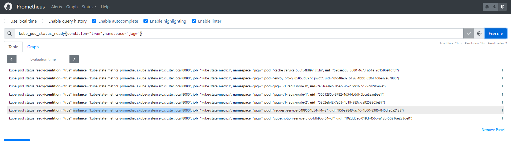

# Jalapeno Changes 

Arangodb and grafana were deploy with Helm chart, to implement health endpoints and monitoring, templates for the two of them were created. So now for arango, we don't need to rebuild the helm chart anymore. If you want to use the old Helm chart, a folder named 'old-chart' was created at the source of Jalapeno repository where the old arango and grafana were used before.

## Prometheus 

Prometheus monitoring was created. You can find the source code here :  https://devopscube.com/setup-prometheus-monitoring-on-kubernetes/
The templates were created by modifying the source code. 
A folder named prometheusHelm was created in  jalapeno-helm/jalepeno-helm/ where you can find prometheus templates but also Kube state metrics service that will provide many metrics which is not available by default.  Kube state metrics allow to monitor all your kubernetes API objects like deployments, pods, jobs, cronjobs... : https://devopscube.com/setup-kube-state-metrics/ . 

Prometheus services are running on monitoring namespace 
Kube state metrics are running on kube-system namespace 
This was the inital configuration, did not change it because of some problems with grafana. 

You can access the web UI of prometheus: 

```bash
http://workernodeIp:nodePort
```

You should arrive on this page 


To see if everything is working, especially kube state metric , go to Status > Target and you should see :


If everything is working you can now, try some expression and see what data you can monitor, example: 



You can show it as tables or graph :


You can also do some alerting if needed. 


## Grafana 

Grafana templates were created to link it to prometheus based on the existing helm chart, to add the link to prometheus I used this documentation: https://devopscube.com/setup-grafana-kubernetes/, the changes were made on /jalapeno-helm/templates/grafana/grafana-cm and /jalapeno-helm/templates/grafana/grafana-deploy files.
The image was updated to a new version, so the Web UI is a new version also but still look like the old one. 

You can access the web UI : 

```bash
http://workernodeIp:nodePort
```
you should arrive on this : 


Here the list of expression i used to build the graphs on grafana but first i verified them on prometheus: 

- count by (namespace) (kube_deployment_created{namespace=~"jagw|jalapeno"})
- sum by (namespace) (kube_pod_info{namespace=~"jagw|jalapeno"})
- count by (statefulset,namespace) (kube_statefulset_replicas{namespace=~"jagw|jalapeno"})
- (kube_deployment_status_replicas{namespace="jagw"}/kube_deployment_spec_replicas{namespace="jagw"})*100
- (kube_deployment_status_replicas{namespace="jalapeno"}/kube_deployment_spec_replicas{namespace="jalapeno"})*100
- kube_pod_status_ready{condition="true",namespace="jagw"}
- kube_pod_status_ready{condition="true",namespace="jalapeno"}
- kube_pod_status_ready{namespace=~"$Namespace",pod=~"$Pod"}
- sum by (pod) (rate(container_cpu_usage_seconds_total{job="kubernetes-cadvisor",namespace="jagw"}[1m]))
- sum by (pod) (rate(container_cpu_usage_seconds_total{job="kubernetes-cadvisor",namespace="jalapeno"}[1m]))
- container_memory_usage_bytes{job="kubernetes-cadvisor",namespace="jagw",container!=""}
- container_memory_usage_bytes{job="kubernetes-cadvisor",namespace="jalapeno",container!=""}

you can find how to create expression on these web site: 
- https://www.tigera.io/learn/guides/prometheus-monitoring/prometheus-metrics/
- https://prometheus.io/docs/prometheus/latest/querying/functions/#rate 
- https://prometheus.io/docs/prometheus/latest/querying/operators/
- https://promlabs.com/promql-cheat-sheet/ 

The graphs should look like this: 


Some graphs were created, you can download it here: 

[click me to download](https://github.com/inesbenltaifa/jalapeno-helm/blob/main/jalapeno-helm/graph/>)

## Arangodb

Arango templates were created based on the previous Helm Chart, and health endpoint was added, you can see it in /jalapeno-helm/templates/arangodb-helm/deployment.yaml; a readiness was added. 
To access the web UI: 

```bash
http://workernodeIp:nodePort
```

## Telegraph ingress and egress 

Health endpoint were added in telegraph egress and ingress, by adding, first a plugin 'inputs.http_listener_v2' in both configfMaps, you can find all the plugin: https://docs.influxdata.com/telegraf/v1/plugins/#input-plugins, and some inspiration on how to implement it here : https://github.com/influxdata/telegraf/blob/release-1.29/plugins/inputs/http_listener_v2/README.md. Second, a readinessProbe was added in both ingress and egress, youcan find it in the deployment files.

The image was updated to a new version. There was no problem for the ingress pod but by updating the egress image some issue appeared because of some permission denied. 
The issue was that telegraph image up to 1.20.3 no longer run the Telegraf service as root. With this change, the Telegraf service runs with the least amount of privileges in the container to enhance security given the wide extensibility and array of plugins available in Telegraf.
This issue appear because the updated image is tagged with 1.29 and in the configMap we are trying to write a file named metric.out, but with the limit of priviledges it couldn't be written, the solution was to change the path 


You can find the real explanation here : https://www.influxdata.com/blog/docker-run-telegraf-as-non-root/ 

## Topology and lslinknode

The name of the service of arangodb component was hard coded in the deployment of the topology and lslinknode component, so when i change the arangodb service name, i had some issue with those two pods, i coded it by using the name in the values.yaml. It was already a task TO DO in the code. 

## Kafka 

The image was updated by a new version 


## TO DO 

List of storage fro grafana 
Influx as a data source aytomotocs with prometheus 
Modify version of helm chart and image (see for arrango , kafka , redis , influx, redis )

## NOT DONE 

Since some image came from jalapeno repository i did not change the image and did not add a health endpoint for example for gobmp, topology , lslinknode.
Influxdb, kafka and zookeeper had already a health endpoint but maybe the helm chart version can be updated.

